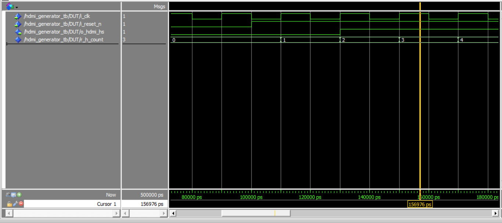

<p align="left">  </p>

# TP FPGA
### GUIFFAULT Gabriel JACQUOT Nolan
# 1 Tutoriel Quartus
### 1.1 Création d’un projet
Pour creer le projet sur Quartus :
- File > New Project Wizard
- choisir le FPGA suivant : 5CSEBA6U23I7
- La dernière page est un récapitulatif, cliquez sur Finish

### 1.2 Création d’un fichier VHDL

- Pour créer un nouveau fichier
File > New
- Une fenêtre s’ouvre, il faut sélectionner
VHDL File

Ci dessous un exemple de composant pour alumer ou éteindre une LED via l'appui d'un bouton:
```vhd
library ieee;
use ieee.std_logic_1164.all;
entity tuto_fpga is
port (
sw : in std_logic;
led : out std_logic
);
end entity tuto_fpga;
architecture rtl of tuto_fpga is
begin
led <= sw;
end architecture rtl;
```
### 1.3 Fichier de contrainte

Nous utilisons la DE10-Nano, il y a plusiers LED et plusieurs Switches :

LED0 est sur la broche PIN_W15
SW0 est sur la broche PIN_Y24
Quartus ne peut pas connaître ces informations, il faut donc lui préciser.

- Avant toute chose, il faut synthétiser le projet. Pour cela, on lance Analysis & Synthesis
- Ensuite, cliquez sur : Assignments > Pin Planner
- Nous pouvons dans cette fenetre assigner les pin identifié plus haut au composants correspondants :


  
### 1.4 Programmation de la carte

- Nous compilons l’intégralité du projet avec Compile Design
- Lancer l’outil de programmation du FPGA Tools > Programmer
- Une fenêtre s’ouvre : Cliquez sur Auto Detect
- Deux fenêtres pop-up apparaissent successivements, acceptez les paramètres par défaut
- Le schéma de deux puces apparait.
- Celle que l'on sélectionne est celle notée 5CSEBA6
- Chargez le bitstream : Clic-droit sur la puce > Edit > Change File
- Sélectionnez le fichier .sof dans output_files
- Cochez la case Program / Configure
- Programmez la carte
- Cliquez sur Start


### 1.5 Modification du VHDL

Nous allons remplacer nos std_logic par des
std_logic_vector.
```vhd
library ieee;
use ieee.std_logic_1164.all;
entity tuto_fpga is
port (
sw : in std_logic_vector(3 downto 0);
led : out std_logic_vector(3 downto 0)
);
end entity tuto_fpga;
architecture rtl of tuto_fpga is
begin
led <= sw;
end architecture rtl;
```
### 1.6 Faire clignoter une LED
### 1.7 Chenillard !
# 2 Petit projet : Bouncing ENSEA Logo

### Objectif :
Sur la sortie HDMI, faire rebondir le logo ENSEA, comme dans les
lecteurs DVD (https://www.bouncingdvdlogo.com/).

### 2.1 Contrôleur HDMI

Objectif : Le contrôleur HDMI génère les signaux nécessaires au HDMI Transmitter. Il génère également des signaux en direction de la circuitrie qui génère
les images.

1. Récupérez les ressources sur moodle.
   
Parmi ces ressources, vous trouverez :
- Un projet Quartus disposant du pinout déjà configuré.
- Le fichier DE10_Nano_HDMI_TX.vhd : C’est le top du projet, il définit les entrées/sorties.
- Les fichiers I2C_HDMI_Config.v et I2C_Controller.v : Permettent de configurer le HDMI Transmitter. Ils sont déjà instanciés dans le top.
- Le fichier hdmi_generator.vhd à compléter. Il est en partie instancié dans le top, à compléter également.

Vous devrez simuler votre contrôleur HDMI avant de le tester sur la carte.

C’est à vous de créer le testbench et le script de compilation (fichier .do).
Le code de l’entity est donné en figure 1.

2. Analysez l’entity :

- Quel est le rôle des différents paramètres définis en generic ?
- Quel est leur unité ?
Voici le rôle de certain des signaux :
- o_new_frame : Passe à l’état haut pendant 1 cycle d’horloge quand une image a fini d’être transmise
- o_pixel_pos_x et o_pixel_pos_y : Positions en X et Y des pixels sur la zone d’affichage active.
- o_pixel_address : Adresse du pixel obtenue par la formule suivante : o_pixel_pos_x + (h_res × o_pixel_pos_y)
3. Rappelez le rôle des autres signaux


```vhd
entity hdmi_generator is
generic (
-- Resolution
h_res : natural := 720;
v_res : natural := 480;
-- Timings magic values (480p)
h_sync : natural := 61;
h_fp : natural := 58;
h_bp : natural := 18;
v_sync : natural := 5;
v_fp : natural := 30;
v_bp : natural := 9
);
port (
i_clk : in std_logic;
i_reset_n : in std_logic;
o_hdmi_hs : out std_logic;
o_hdmi_vs : out std_logic;
o_hdmi_de : out std_logic;
o_pixel_en : out std_logic;
o_pixel_address : out natural range 0 to (h_res * v_res -
,→ 1);
o_x_counter : out natural range 0 to (h_res - 1);
o_y_counter : out natural range 0 to (v_res - 1);
o_pixel_pos_x : out natural range 0 to (h_res - 1);
o_pixel_pos_y : out natural range 0 to (v_res - 1);
o_new_frame : out std_logic
);
end hdmi_generator;
```
### 2.1.1 Écriture du composant

1. Écrivez un compteur horizontal (h_count) qui boucle de 0 à h_total, et qui
génère le signal de synchronisation horizontal (o_hdmi_hs).

2. Testez à l’aide d’un testbench. Vous pouvez réduire artificiellement les tailles
d’images pour réduire le temps de simulation.
<p align="left">  </p>
3. Ajoutez un compteur vertical (v_count) qui s’incrémente à chaque cycle du
compteur horizontal, et boucle de 0 à v_total. Le compteur vertical doit
également générer le signal de synchronisation vertical (o_hdmi_vs).

4. Adaptez le testbench pour tester l’ensemble.

5. Déterminez les plages de h_count et v_count où les pixels sont visibles
(zone active) et implémentez les signaux h_act et v_act pour les indiquer.

6. Combinez h_act et v_act pour produire un signal o_hdmi_de indiquant si
le générateur est dans une zone active (ligne active et pixel actif).

7. Ajoutez un compteur de pixels actifs (r_pixel_counter) pour générer une
adresse pixel o_pixel_address, qui incrémente uniquement dans les zones
actives. Réinitialisez-le au début de chaque nouvelle image.

8. Ajoutez deux compteurs pour générer les signaux o_x_counter et o_y_counter
permettant de compter les pixels actifs.

9. Testez votre composant.

### 2.1.2 Implémentation sur le FPGA

## 2.2 Bouncing ENSEA Logo

Dans cette partie, nous utiliserons une architecture scanline rendering pour
afficher et déplacer le logo ENSEA. Le logo sera stocké dans une mémoire RAM.
Pour aller plus vite, le code de la RAM initialisée est fourni sur Moodle.

1. Instanciez la mémoire dans votre projet
2. Écrivez le code permettant d’afficher l’image en haut à gauche de l’écran.
3. Testez et montrez à votre encadrant.
### 2.2.1 Déplacer le logo
